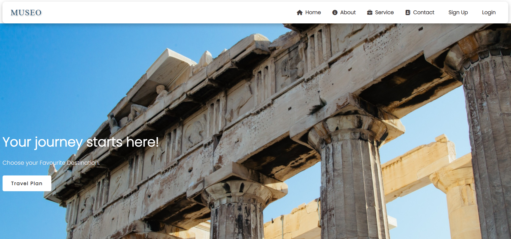
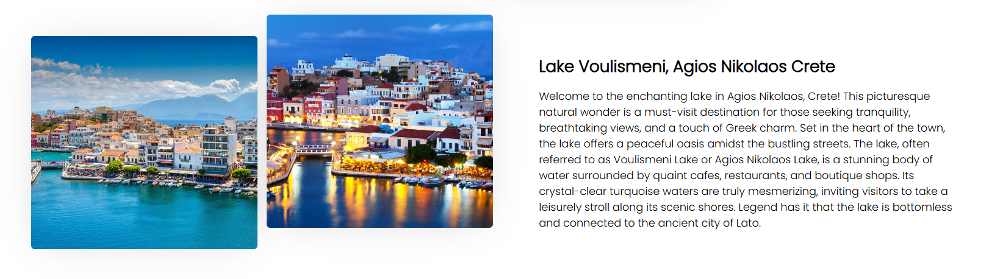
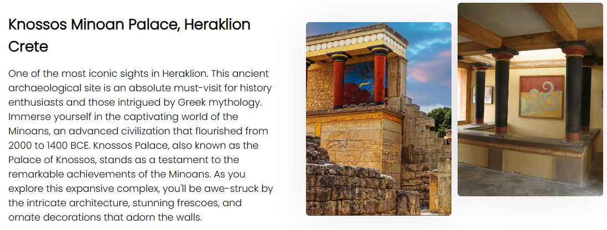
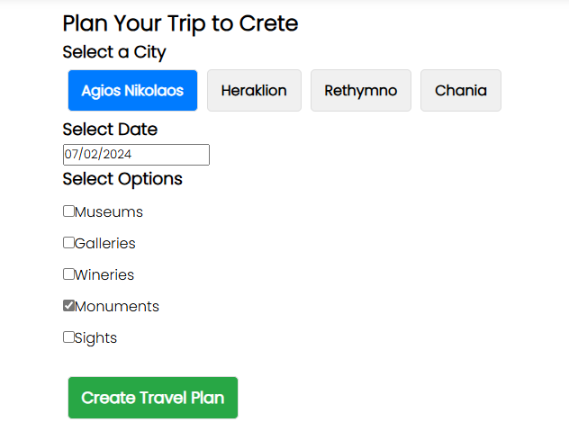
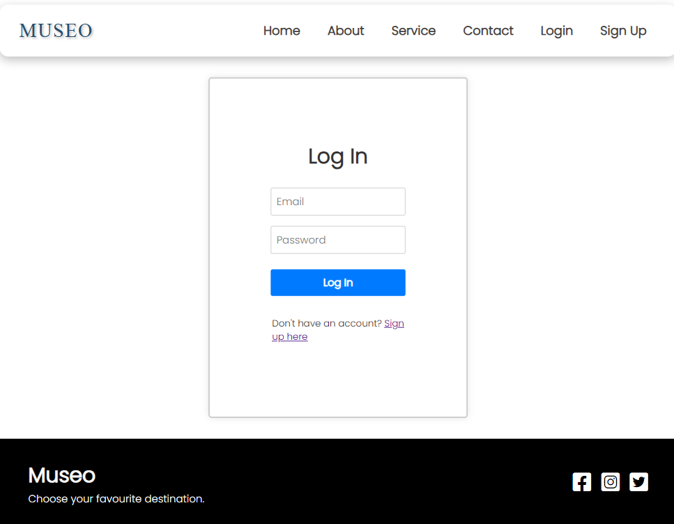

# Museo - A Full Stack Tourism Web Application


## 📌 Overview

Museo is a full-stack web application designed to enhance the tourism experience in Crete, Greece. It recommends monuments and points of interest based on user input. The app provides details like working hours, locations, and prices. Data is sourced from a custom XML file.

---

## 🏗️ Features

- **User Input**: Users can input their preferences and requirements.
- **Recommendations**: The app recommends monuments and points of interest based on the user's input.
- **Detailed Information**: Provides detailed information about each recommended place, including working hours, locations, and prices.
- **XML Data Source**: All data is sourced from a custom XML file.

---

## ✨ Technologies Used

- **Frontend**: React.js, HTML, CSS, JavaScript
- **Backend**: MySQL
- **Server**: XAMPP

---

## 🖼️ Screenshots

### Home Page



### Recommendation Page



### Monument Details



### Travel Plan



### Login Page



---

## 🛠️ Installation & Setup

1. Clone the repository:

   ```bash
   git clone https://github.com/yourusername/museo-frontend.git
   ```

2. Navigate to the project directory:

   ```bash
   cd museo-frontend
   ```

3. Install dependencies:

   ```bash
   npm install
   ```

4. Start the development server:

   ```bash
   git clone https://github.com/kdetorakis/react
   cd museo
   ```

---

## 📜 Project Structure

```
/museo-frontend
│── /src
│   │── /components  # Reusable UI components
│   │── /pages       # Application pages
│   │── /utils       # Utility functions
│   │── App.js       # Main application component
│   │── index.js     # Entry point
│── /public         # Static assets
│── package.json    # Project metadata
│── README.md       # Documentation
```

---

## 🚀 Future Enhancements

- Implement authentication
- Add user reviews and ratings
- Improve UI with interactive maps

---

## 🔒 Full Source Code Access

This repository contains only public documentation and frontend details.  

*To request full access:*

1. Open an issue [here](https://github.com/kdetorakis/react).
2. Briefly state why you need access.
3. I'll review and grant permissions accordingly.
*(If access is denied, please email me to request permission.)*

---
